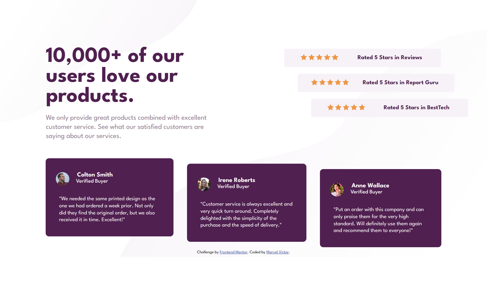

# Frontend Mentor - Social proof section solution

This is a solution to the [Social proof section challenge on Frontend Mentor](https://www.frontendmentor.io/challenges/social-proof-section-6e0qTv_bA). Frontend Mentor challenges help you improve your coding skills by building realistic projects. 

## Table of contents

- [Overview](#overview)
  - [The challenge](#the-challenge)
  - [Screenshot](#screenshot)
  - [Links](#links)
- [My process](#my-process)
  - [Built with](#built-with)
  - [What I learned](#what-i-learned)
  - [Continued development](#continued-development)
  - [Useful resources](#useful-resources)
- [Author](#author)


## Overview

### The challenge

Users should be able to:

- View the optimal layout for the section depending on their device's screen size

### Screenshot




### Links

- Frontend Mentor Solution URL: [Frontend Mentor Solution URL](https://www.frontendmentor.io/solutions/social-proof-section-challenge-solution-AfvXX4D1nz)
- GithubL: [Github Hosted Codes](https://github.com/Mharvel13/Social-Proof-Section-Challenge-Master)
- Live Site URL: [Live site URL](https://mharvel13.github.io/Social-Proof-Section-Challenge-Master/)

## My process

### Built with

- Semantic HTML5 markup
- CSS custom properties
- Flexbox
- CSS Grid
- Mobile-first workflow
- SASS preprocessor

### What I learned

I learnt how to use SASS preprocessor in writting CSS and the DRY concept in coding.
I also utilized the Grid system in making responsive layouts for different screensizes

The use of Pseudo selectors was also used as seen below.


```css
.showcase-rating:nth-child(2){
    position: relative;
    left: 2.5rem;
}

.showcase-rating:nth-child(3){
    position: relative;
    left: 5rem;
}
```

### Continued development

For continued development, More indepth use of SASS will be employed to make The CSS writting less repettive


### Useful resources

- [W3schools SASS Tutorials](https://www.w3schools.com/sass/) - This helped me for Understanding how to use and apply SASS in a project. The documentation was really detailed and straightforward

<!-- - [Example resource 2](https://www.example.com) - This is an amazing article which helped me finally understand XYZ. I'd recommend it to anyone still learning this concept. -->


## Author

- GitHub Profile - [Mharvel13](https://github.com/Mharvel13)
- Frontend Mentor - [Marvel Victor](https://www.frontendmentor.io/profile/Mharvel13)
- Twitter - [Marvel](https://twitter.com/Mharvel_O)


